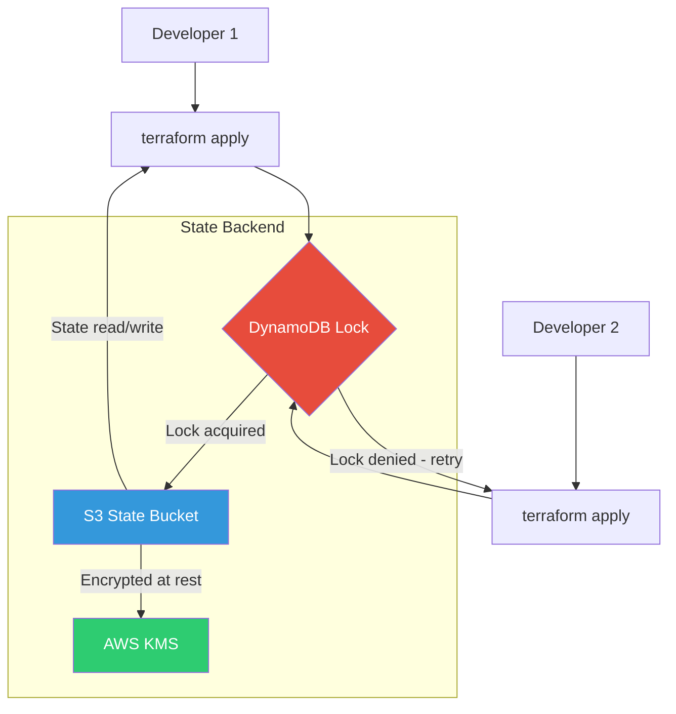

# Daily Lesson - 2026-02-17

## Lesson: Terraform State Management

**Date:** February 17, 2026
**Topic:** Managing Terraform State Safely with Remote Backends
**Difficulty:** Intermediate

---

### Why State Management Matters

Terraform state is the **source of truth** for your infrastructure. It maps your configuration to real-world resources. Poor state management leads to:

- **State conflicts** when multiple team members run `terraform apply` simultaneously
- **Data loss** if the state file is corrupted or deleted
- **Security risks** since state contains sensitive values (passwords, keys) in plaintext

---

### Remote State Architecture



---

### State File Structure

A Terraform state file contains:

```json
{
  "version": 4,
  "terraform_version": "1.7.0",
  "serial": 42,
  "lineage": "a1b2c3d4-e5f6-7890-abcd-ef1234567890",
  "outputs": {
    "vpc_id": {
      "value": "vpc-0abc123def456",
      "type": "string"
    }
  },
  "resources": [
    {
      "mode": "managed",
      "type": "aws_vpc",
      "name": "main",
      "provider": "provider[\"registry.terraform.io/hashicorp/aws\"]",
      "instances": [
        {
          "attributes": {
            "id": "vpc-0abc123def456",
            "cidr_block": "10.0.0.0/16"
          }
        }
      ]
    }
  ]
}
```

Key fields: **serial** increments on each write (optimistic locking), **lineage** identifies the state chain.

---

### Code: Setting Up the Backend Configuration

```hcl
# backend.tf — Remote state with S3 and DynamoDB locking

terraform {
  required_version = ">= 1.5.0"

  backend "s3" {
    bucket         = "mycompany-terraform-state"
    key            = "environments/production/core-infra/terraform.tfstate"
    region         = "us-east-1"
    encrypt        = true
    kms_key_id     = "arn:aws:kms:us-east-1:123456789:key/mrk-abc123"
    dynamodb_table = "terraform-state-locks"
    # Enable state file versioning for rollback capability
  }
}

# --- Bootstrap module (run once to create the backend resources) ---

resource "aws_s3_bucket" "terraform_state" {
  bucket = "mycompany-terraform-state"

  lifecycle {
    prevent_destroy = true
  }

  tags = {
    Purpose   = "Terraform State Storage"
    ManagedBy = "terraform-bootstrap"
  }
}

resource "aws_s3_bucket_versioning" "state_versioning" {
  bucket = aws_s3_bucket.terraform_state.id

  versioning_configuration {
    status = "Enabled"
  }
}

resource "aws_s3_bucket_server_side_encryption_configuration" "state_encryption" {
  bucket = aws_s3_bucket.terraform_state.id

  rule {
    apply_server_side_encryption_by_default {
      sse_algorithm     = "aws:kms"
      kms_master_key_id = aws_kms_key.terraform_state.arn
    }
  }
}

resource "aws_s3_bucket_public_access_block" "state_public_access" {
  bucket = aws_s3_bucket.terraform_state.id

  block_public_acls       = true
  block_public_policy     = true
  ignore_public_acls      = true
  restrict_public_buckets = true
}

resource "aws_dynamodb_table" "terraform_locks" {
  name         = "terraform-state-locks"
  billing_mode = "PAY_PER_REQUEST"
  hash_key     = "LockID"

  attribute {
    name = "LockID"
    type = "S"
  }

  tags = {
    Purpose   = "Terraform State Locking"
    ManagedBy = "terraform-bootstrap"
  }
}

resource "aws_kms_key" "terraform_state" {
  description             = "KMS key for Terraform state encryption"
  deletion_window_in_days = 30
  enable_key_rotation     = true
}
```

---

### Common Pitfalls and Solutions

| Pitfall | Symptom | Solution |
|---------|---------|----------|
| Forgetting to init backend | `Backend initialization required` | Run `terraform init -migrate-state` |
| State lock stuck | `Error locking state: ConditionalCheckFailedException` | `terraform force-unlock <LOCK_ID>` (use with caution) |
| State drift | Resources modified outside Terraform | Run `terraform refresh` or `terraform import` |
| Large state files | Slow plan/apply, timeouts | Split into smaller state files per module |
| Secrets in state | Passwords visible in `terraform.tfstate` | Use `sensitive = true`, encrypt backend, restrict access |
| Lost state file | Cannot manage existing resources | Recreate with `terraform import` for each resource |

---

### Summary & Key Takeaways

- **Never** store state locally in team environments — use a remote backend.
- S3 + DynamoDB is the gold standard for AWS-based Terraform state management.
- **Enable versioning** on your S3 bucket so you can recover from state corruption.
- **Encrypt** state at rest (KMS) and in transit (TLS) — state contains secrets.
- Use a **consistent key naming convention** for state files (e.g., `env/region/component`).
- Split large monolithic states into **smaller, scoped state files** per module or service.

---

### Next Lesson Preview

**2026-02-18: Terraform Workspaces vs Directory Structure** — We will compare workspace-based environment management with directory-based layouts and when each approach shines.
